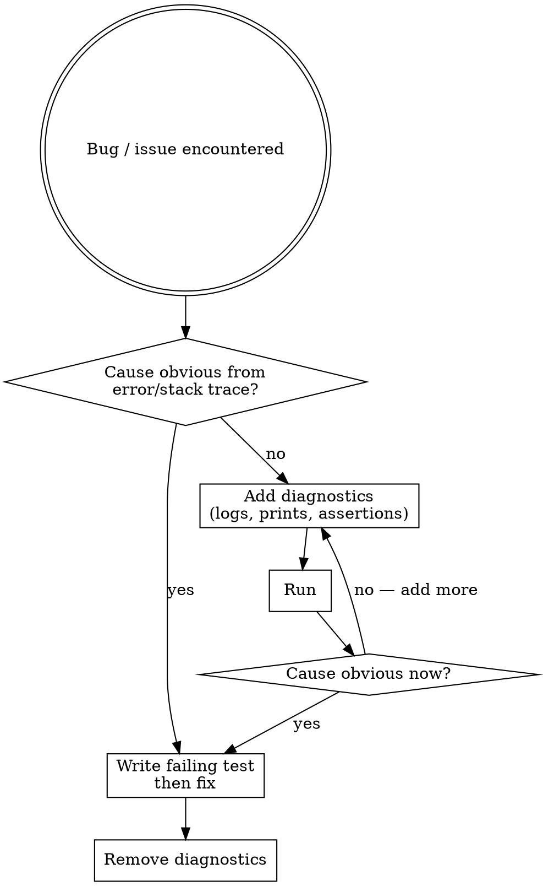

# Instrument-First Debugging

## Overview

Don't think, instrument. If the error doesn't point to an exact line, add diagnostics and run. Repeat until obvious, then fix with a failing test first.


## The Diagnostic Loop



**"Obvious" means:** the error message or stack trace points to the exact line/variable. Anything less is not obvious — instrument instead.

## When Many Tests Are Failing

Don't try to fix them all at once. Pick one known failing test, run only that test, fix it, then move on. Running the full suite on every iteration wastes time and floods output with noise that obscures the actual problem.

- Run a single test: `jest --testNamePattern "name"`, `pytest -k "test_name"`, `vitest run path/to/test`
- Fix it fully before touching any other failing test
- Only re-run the full suite once the targeted test is green

## Shrink the Feedback Loop

Every iteration should be as fast as possible:

- **Fail fast:** If a test takes a long time but the failure occurs early, add an assertion that throws as soon as state diverges from expected — don't wait for the full run
  - Example: test takes 5 min, failure at 10s → add `assert(state === expected)` at the 10s mark
- **Write a diagnostic test:** If a test is slow and you can't easily add assertions to it, write a new minimal diagnostic test that exercises only the suspected part. Run that instead. Delete it once the issue is found.
- **Kill a hanging test:** If a test is taking longer than you'd expect, don't wait — kill it (Ctrl+C). A test that runs longer than expected is itself a diagnostic signal. Add diagnostics, reduce the input, or write a smaller diagnostic test to find what's hanging.
- **Reduce data:** Shrink the input to the minimal set that reproduces the issue
- **Isolate the path:** Run just the failing code path rather than the full suite

**Custom diagnostic logger:** If the repo's existing logger is too verbose to follow, create a dedicated diagnostic file (e.g. `diag-debug.ts`) that logs to a separate output file. Always add this header:

```
// DIAGNOSTIC FILE — NOT PRODUCTION CODE
// Created to find: <brief description of issue>
// Delete when issue is resolved.
```

**Isolation scripts:** If the issue involves interaction between specific files and you know the inputs that trigger it, write a standalone script that imports only those files and feeds them the same inputs. Store outside production code — use the project's designated temp directory, or `C:\Users\email\AppData\Local\Temp\` for standalone diagnostic scripts not tied to a specific project. Use the same "DIAGNOSTIC FILE" header. Especially useful when: the issue has already taken a while to find, or the normal test suite is slow/noisy.

**Remember:** all diagnostic files, logs, and isolation scripts must be removed once the fix is in place.

## Red Flags — Stop and Add Diagnostics Instead

| Thought | Reality |
|---------|---------|
| "I think I know what's causing this" | You don't — not until diagnostics confirm it. Instrument. |
| "Let me trace through the logic" | Reading code to guess is slower than running it with diagnostics. |
| "It's probably X" | Probably is not obviously. Instrument. |
| "Let me look at the code more carefully" | More reading ≠ more certainty. Add a log, run it. |
| "The issue is likely in this area" | Narrow it with diagnostics, not intuition. |
| "I just need to understand the flow first" | The flow will be obvious once you can see runtime values. |

**Stop and add diagnostics if:**
- You've been reading code for more than 60 seconds without running anything
- You're forming a theory before seeing runtime data
- You're explaining what you think is happening instead of observing what is happening

## Diagnostic Example

```typescript
// BEFORE: reading and theorizing
function processItems(items: Item[]) {
  const filtered = items.filter(x => x.active);
  const mapped = filtered.map(transform);
  return mapped.reduce(merge, {});
}

// AFTER: add diagnostics to observe state at each step
function processItems(items: Item[]) {
  console.log('[diag] input items:', items.length, items);
  const filtered = items.filter(x => x.active);
  console.log('[diag] after filter:', filtered.length, filtered);
  const mapped = filtered.map(transform);
  console.log('[diag] after map:', mapped);
  return mapped.reduce(merge, {});
}
// Run — output shows exactly where data goes wrong.
// Remove all [diag] lines once cause is obvious.
```

Use whatever is fastest: `console.log`, `print`, a logger, an assertion that throws — the pattern is language-agnostic.

## After Finding Root Cause

1. Write a failing test that reproduces the bug (use `test-writer` skill)
2. Fix the root cause
3. Verify the test passes
4. Remove all diagnostic code (logs, custom logger files, isolation scripts)
